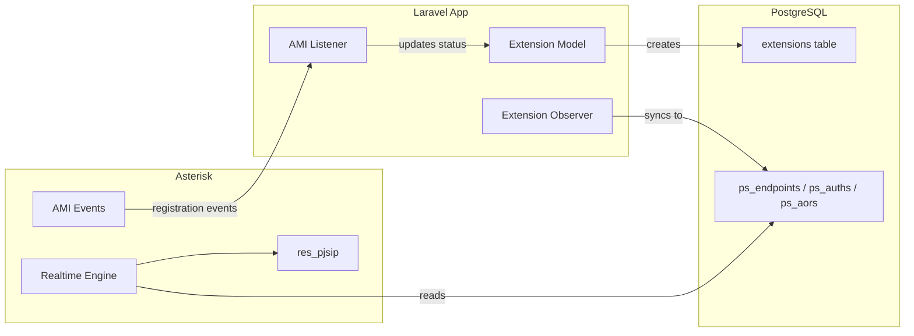

# Asterisk PJSIP Realtime Database Integration

## Overview

Configure Asterisk to read PJSIP endpoint/auth/aor configuration directly from PostgreSQL using the Realtime engine. When Laravel creates/updates/deletes extensions, Asterisk will see the changes immediately without reload.



## Implementation Steps

### Phase 1: Database Schema for PJSIP Realtime

Create migrations for the PJSIP realtime tables that Asterisk expects. These are separate from your Laravel `extensions` table.

**Tables needed:**

- `ps_endpoints` - Main endpoint configuration
- `ps_auths` - Authentication credentials  
- `ps_aors` - Address of Record (registration storage)

Reference: [Asterisk PJSIP Realtime Schema](https://wiki.asterisk.org/wiki/display/AST/PJSIP+Configuration+for+Realtime)

Key fields in `ps_endpoints`:

```
id, transport, aors, auth, context, disallow, allow, 
direct_media, callerid, mailboxes
```

### Phase 2: Extension Observer for Sync

Create an Eloquent Observer on the Extension model that automatically syncs data to the `ps_*` tables.

**File:** `app/Observers/ExtensionObserver.php`

When an extension is:

- **Created**: Insert into `ps_endpoints`, `ps_auths`, `ps_aors`
- **Updated**: Update corresponding rows
- **Deleted**: Delete from all three tables

The observer will transform Laravel extension data to PJSIP format:

- Extension number becomes endpoint ID
- Password goes to `ps_auths.password` (plain text for PJSIP)
- Voicemail settings become mailbox config
- Caller ID fields map directly

### Phase 3: Asterisk Configuration

**A. Install PostgreSQL ODBC driver and configure:**

- `/etc/odbc.ini` - Database connection
- `/etc/odbcinst.ini` - Driver definition

**B. Configure Asterisk Realtime:**

- `extconfig.conf` - Map PJSIP objects to database tables
- `res_odbc.conf` - ODBC connection settings
- `sorcery.conf` - Tell PJSIP to use realtime for config

**C. Basic dialplan in `extensions.conf`:**

- Context for internal calls
- Context for inbound from carriers
- Context for outbound to carriers

### Phase 4: AMI Event Listener Enhancement

Enhance existing [app/Console/Commands/AmiListener.php](app/Console/Commands/AmiListener.php) to:

1. Listen for `ContactStatus` and `DeviceStateChange` events
2. When extension registers/unregisters:

   - Update `extensions.status` (online/offline)
   - Update `extensions.last_registered_at`
   - Update `extensions.last_registered_ip`

3. Broadcast status change via Laravel events for real-time dashboard

### Phase 5: Service Class for PJSIP Sync

Create a dedicated service for PJSIP database operations:

**File:** `app/Services/Asterisk/PjsipRealtimeService.php`

Methods:

- `syncEndpoint(Extension $extension)` - Create/update endpoint
- `deleteEndpoint(string $id)` - Remove endpoint
- `getRegistrationStatus(string $endpoint)` - Query current status

### Phase 6: Artisan Commands

**A. Initial Sync Command:**

```
php artisan asterisk:sync-extensions
```

Syncs all existing extensions to PJSIP tables.

**B. Verify Command:**

```
php artisan asterisk:verify-config
```

Checks Asterisk connectivity and config validity.

---

## File Changes Summary

| File | Action |

|------|--------|

| `database/migrations/xxxx_create_pjsip_realtime_tables.php` | Create |

| `app/Observers/ExtensionObserver.php` | Create |

| `app/Providers/AppServiceProvider.php` | Modify (register observer) |

| `app/Services/Asterisk/PjsipRealtimeService.php` | Create |

| `app/Console/Commands/AmiListener.php` | Enhance |

| `app/Console/Commands/SyncExtensionsCommand.php` | Create |

| `app/Console/Commands/VerifyAsteriskCommand.php` | Create |

| `config/asterisk.php` | Create (AMI/connection settings) |

---

## Asterisk Files to Configure (Manual)

These files need to be configured on the Asterisk server:

1. `/etc/odbc.ini` - PostgreSQL connection
2. `/etc/asterisk/res_odbc.conf` - ODBC resource
3. `/etc/asterisk/extconfig.conf` - Realtime mapping
4. `/etc/asterisk/sorcery.conf` - PJSIP sorcery config
5. `/etc/asterisk/pjsip.conf` - Transports only (endpoints from DB)
6. `/etc/asterisk/extensions.conf` - Basic dialplan

I can provide example configurations for each.

---

## Testing Flow

1. Create extension 1001 in Laravel
2. Verify rows exist in `ps_endpoints`, `ps_auths`, `ps_aors`
3. Register a softphone to extension 1001
4. Verify `extensions.status` updates to "online"
5. Make a test call between two extensions