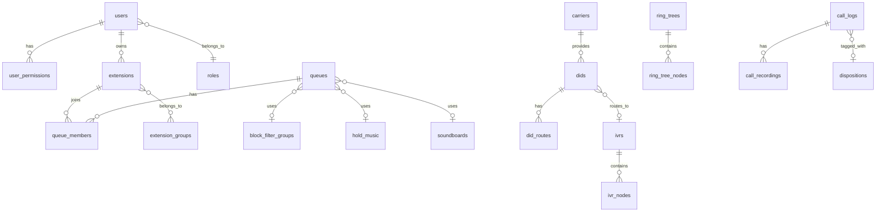

# Mini PBX System - Laravel 12 + Asterisk 22

## Technology Stack

| Component | Technology |

|-----------|------------|

| Backend | Laravel 12, PHP 8.3 |

| Frontend | Tailwind CSS, Alpine.js, Livewire |

| Database | PostgreSQL 17 |

| PBX | Asterisk 22 with PJSIP |

| Real-time | Laravel Reverb (WebSockets), AMI, ARI |

| WebRTC | SIP.js |

| Auth | Laravel Breeze |

| Queue | Laravel Horizon (Redis) |

## Architecture Overview

```mermaid
graph TB
    subgraph frontend [Frontend Layer]
        UI[Laravel Blade + Tailwind]
        WebRTC[SIP.js Softphone]
        WS[WebSocket Client]
    end
    
    subgraph backend [Backend Layer]
        Laravel[Laravel 12 App]
        Reverb[Laravel Reverb]
        Jobs[Queue Jobs]
    end
    
    subgraph asterisk [Asterisk Layer]
        AMI[AMI Socket]
        ARI[ARI REST API]
        AST[Asterisk 22]
    end
    
    subgraph storage [Data Layer]
        PG[(PostgreSQL 17)]
        Redis[(Redis)]
        Files[Config Files]
    end
    
    UI --> Laravel
    WebRTC --> AST
    WS --> Reverb
    Laravel --> AMI
    Laravel --> ARI
    Laravel --> PG
    Laravel --> Redis
    Laravel --> Files
    Reverb --> Redis
    Jobs --> Redis
    AMI --> AST
    ARI --> AST
    Files --> AST
end
```

## Database Schema (Key Tables)



## Theme Design

- **Primary Color**: Indigo (`#4F46E5` / `indigo-600`)
- **Accent Color**: Teal (`#14B8A6` / `teal-500`)
- **Dark Sidebar**: Slate-900 background with indigo highlights
- **Light/Dark Mode Toggle**: System preference detection + manual toggle
- **Layout**: Fixed left sidebar (collapsible on mobile), top header bar

## Module Breakdown

### Phase 1: Foundation (Core Setup)

1. **Project Setup**

   - Laravel 12 installation with Breeze
   - PostgreSQL 17 configuration
   - Tailwind CSS with custom theme (Indigo/Teal)
   - Dark/Light mode implementation
   - Responsive sidebar layout

2. **Authentication & Authorization**

   - Role-based permissions (Superadmin, Admin, Quality Analyst, Manager, Agent)
   - Granular permission system with Spatie Laravel Permission
   - Single session enforcement
   - 8-hour session timeout

3. **Core Services**

   - AMI connection manager (configurable)
   - ARI connection manager (configurable)  
   - Asterisk config file generator service
   - Audio file converter (MP3 to Asterisk format using FFmpeg)

### Phase 2: Telephony Management

4. **Extensions Module**

   - PJSIP endpoint management (username, agent name, password)
   - Create, Update, Delete, Status toggle
   - Bulk create via CSV/Excel upload
   - Bulk actions (enable/disable/delete)
   - Email credentials to user
   - Config file generation (`pjsip_endpoints.conf`)

5. **Extension Groups Module**

   - Create groups with ring strategy (Ring All, Hunting)
   - Assign extensions to groups
   - Timeout and failover settings
   - Used for routing and organization

6. **DID Management**

   - DID CRUD with number, description, destination
   - Time-based routing rules (business hours / after hours)
   - Caller ID-based routing
   - Bulk import via CSV/Excel
   - Link to IVR, Queue, Extension, Ring Tree, Voicemail

7. **Call Queues**

   - Queue configuration with priority support
   - VIP caller list for priority routing
   - Agent assignment with manual login/logout
   - Active times and out-of-office settings
   - Hold music assignment
   - Block filter group assignment
   - Soundboard assignment
   - Config file generation (`queues.conf`)

8. **Ring Trees**

   - Up to 3 levels deep
   - Visual tree builder
   - Destinations: Extension, Extension Group, Queue, Hangup, Voicemail, Block Filter
   - Timeout per node

9. **IVR Builder**

   - Visual drag-drop flow designer (using interact.js or similar)
   - Node types: Play audio, Get digits, Route, Time condition, Hangup
   - Audio file upload (MP3 conversion)
   - Dialplan generation (`extensions.conf`)

10. **Block Filter Management**

    - Blacklist and Whitelist support
    - Expiry days per entry
    - Assign to Queues, DIDs, Ring Trees

11. **Voicemail Management**

    - Visual voicemail interface
    - Web audio player
    - Mark read/unread, forward, delete
    - Email notification with attachment
    - Voicemail greeting upload

12. **Hold Music & Soundboard**

    - Multiple hold music classes
    - Upload custom MP3 files (auto-convert)
    - Assign to queues
    - Soundboard: clips playable during calls (to both parties)

### Phase 3: Carriers & Settings

13. **Outbound Carriers**

    - SIP trunk configuration (IP-auth and registration-based)
    - Codec selection
    - Carrier selection on click-to-call

14. **Inbound Carriers**

    - Similar to outbound
    - Link DIDs to carriers

15. **Break Codes**

    - Predefined codes (Lunch, Tea, Training, etc.)
    - Custom code creation
    - Agent break tracking in reports

16. **System Settings**

    - AMI connection settings
    - ARI connection settings
    - Timezone selection (default UTC)
    - SMTP email configuration
    - STUN/TURN server configuration (self-hosted + Google fallback)
    - Data retention (auto-delete after X days, default: disabled)

### Phase 4: Real-time & WebRTC

17. **WebSocket Infrastructure**

    - Laravel Reverb setup
    - Real-time event broadcasting
    - Agent presence channel
    - Call events channel

18. **AMI Event Listener**

    - Background process listening to AMI events
    - Call start/end/state changes
    - Agent state changes
    - Queue events
    - Broadcast to WebSocket

19. **WebRTC Softphone**

    - SIP.js integration
    - Register as PJSIP endpoint
    - Make/receive calls
    - Hold, transfer (blind/attended), mute
    - 3-way ad-hoc conference
    - DTMF support
    - Soundboard playback during call

20. **FOP2-Style Dashboard**

    - Real-time extension status (BLF-like)
    - Active calls display
    - Agent states visualization
    - Visual parking lot
    - Click-to-call
    - Spy/Whisper/Barge buttons (permission-based)
    - Queue statistics
    - Agents in same queue visibility (configurable)

### Phase 5: Call Logs & Analytics

21. **Call Detail Records**

    - Real-time capture via AMI events
    - Periodic sync from Asterisk CDR table
    - Recording path storage
    - In-browser audio player + download

22. **Call Disposition**

    - Predefined codes (Sold, Callback, Not Interested, etc.)
    - Admin-configurable custom codes
    - Required after call wrap-up

23. **Agent Callback Scheduling**

    - Schedule callback with date/time
    - Reminder notifications (browser + desktop)
    - Callback list view

24. **Call Analytics**

    - Inbound/Outbound/Missed call reports
    - Agent performance metrics
    - Queue statistics
    - SLA metrics
    - Hourly/daily/weekly trends
    - Custom report builder
    - Export to CSV/Excel
    - Scheduled email reports (cron-style flexibility)

### Phase 6: Platform Administration

25. **User Management**

    - CRUD for all roles
    - Permission assignment
    - QA-specific permissions (spy/barge) per user
    - Agent queue assignment
    - Extension assignment

26. **API Keys**

    - Generate API keys per user
    - Full REST API access
    - Rate limiting
    - API documentation (auto-generated)

27. **Audit Logging**

    - All configuration changes logged
    - Before/after values stored
    - User, timestamp, IP address
    - Searchable audit trail

28. **System Health Monitoring (Superadmin)**

    - Asterisk connection status
    - Active channels count
    - SIP trunk registration status
    - System resources (if accessible)

29. **Backup & Restore**

    - Export configuration as JSON/ZIP
    - Import/restore from backup
    - Scheduled auto-backup to storage
    - Backup history management

30. **Notifications**

    - Browser push notifications (Web Push API)
    - Desktop notifications (Notification API)
    - Email notifications
    - Notification preferences per user

## Key Files Structure

```
app/
├── Http/Controllers/
│   ├── Telephony/
│   │   ├── ExtensionController.php
│   │   ├── QueueController.php
│   │   ├── DidController.php
│   │   ├── IvrController.php
│   │   └── ...
│   ├── CallLogs/
│   ├── Settings/
│   └── Platform/
├── Models/
│   ├── Extension.php
│   ├── Queue.php
│   ├── Did.php
│   ├── CallLog.php
│   └── ...
├── Services/
│   ├── Asterisk/
│   │   ├── AmiService.php
│   │   ├── AriService.php
│   │   ├── ConfigGenerator.php
│   │   └── AudioConverter.php
│   ├── WebRTC/
│   └── Reports/
├── Jobs/
│   ├── GenerateAsteriskConfig.php
│   ├── SyncCdrRecords.php
│   └── SendScheduledReport.php
├── Events/
│   ├── CallStarted.php
│   ├── AgentStateChanged.php
│   └── ...
└── Listeners/
    └── AmiEventListener.php

resources/views/
├── layouts/
│   └── app.blade.php (sidebar layout)
├── components/
│   ├── sidebar.blade.php
│   ├── softphone.blade.php
│   └── ...
├── dashboard/
├── telephony/
├── call-logs/
├── settings/
└── platform/
```

## Implementation Notes

1. **Asterisk Config Strategy**: Generate individual include files per module, main configs include them. Reload specific modules after changes.

2. **CDR Dual Strategy**: AMI events for real-time display, scheduled job syncs from Asterisk DB hourly for data integrity.

3. **WebRTC**: SIP.js connects directly to Asterisk WebSocket (wss). PJSIP endpoint auto-created for WebRTC users with proper codecs (opus, PCMU, PCMA).

4. **IVR Dialplan**: Store IVR structure in DB, generate `extensions.conf` context per IVR on save.

5. **Audio Conversion**: Use FFmpeg to convert uploaded MP3 to WAV (8kHz, mono, 16-bit) for Asterisk compatibility.

6. **Permissions**: Use Spatie Laravel Permission package. Create granular permissions for each action, assign to roles, allow per-user overrides for QA features.